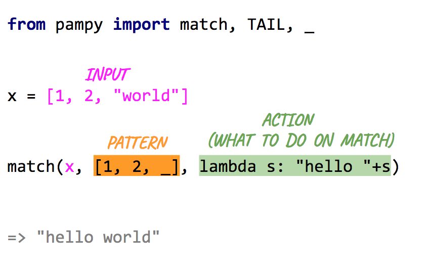

# Pampy: Pattern Matching for Python
Pampy is pretty small, pretty fast, and often makes your code more readable, and easier to reason about.

<kbd>
  
</kbd>

## You can write many patterns

Patterns are evaluated in the order they appear.

```python
from pampy import match, _

match(x,
    pattern1, action1,
    pattern2, action2,
    ...
)
```


## You can write Fibonacci
The operator _ means "any other case I didn't think of".

```python
from pampy import match, _

def fibonacci(n):
    return match(n,
        1, 1,
        2, 1,
        _, lambda x: fibonacci(x-1) + fibonacci(x-2)
    )
```

## You can write a Lisp interpreter in 3 lines

```python
from pampy import match, REST, _

def lisp(exp):
    return match(exp,
        int,                lambda x: x,
        (callable, REST),   lambda f, rest: f(*map(lisp, rest))

lisp((+, 1, (-, 3, (sqrt 2))))         # => 1 + (3 - sqrt(2))
lisp((print (+ "hello " "lisp")))      # => "hello lisp"

```

## You can match so many things!

```python
match(x,
    3,              "this matches the number 3",

    int,            "matches any integer",

    (str, int),     lambda a, b: "a (str, int) tuple used in a lambda",

    [1, 2, _],      "any list of 3 elements that begins with [1, 2]",

    {'x': _},       "any dict with a key 'x' and any value associated",

    _,              "anthing else"
)
```

## You can match [HEAD, TAIL]

```python
from pampy import match, HEAD, TAIL, _

x = [1, 2, 3]

match(x, [1, TAIL],     lambda t: t)            # => [2, 3]

match(x, [HEAD, TAIL],  lambda h, t: (h, t))    # => (1, [2, 3])

```

## You can nest lists and tuples

```python
from pampy import match, _

x = [1, [2, 3], 4]

match(x, [1, [_, 3], _], lambda a, b: [1, [a, 3], b])       # => [1, [2, 3], 4]
```

## All the thnigs you can match

As Pattern you can use any Python type, any class, or any Python value. 

Types and Classes are matched via `instanceof(value, pattern)`.

`Iterable` Patterns match recursively through all their elements. 

The same goes for dictionaries.

| Pattern Example | What it means | Matched Example | NOT Matched Example |
| --------------- | --------------| --------------- | ------------------- |
| `int` | Any integer | `42` |
| `float` | Any float number | `2.35` |
| `str` | Any string | `"hello"` |
| `tuple` | Any tuple | `(1, 2, 3)` |
| `list` | Any list | `[1, 2, 3]` |
| `MyClass` | Any instance of MyClass | `MyClass()` | 
| `_` | Any object (even None) | 
| `(int, int)` | A tuple made of any two integers | `(1, 2)` 
| `[1, 2, _]`  | A list that starts with 1, 2 and ends with any value | `[1, 2, 3]` | `[1, 2, 3, 4]` |
| `[1, 2, TAIL]` | A list that start with 1, 2 and ands with any sequence | `[1, 2, 7, 7]` | `[1, 7, 7, 7]` |
| `[1, TAIL]` | 


## You can nest dicts. And you can use _ as key!

```python

pet = { 'type': 'dog', 'details': { 'age': 3 } }

match(pet, { 'details': { 'age': _ } }, lambda age: age)        # => 3

match(pet, { _ : { 'age': _ } },        lambda a, b: (a, b))    # => ('details', 3)
```

What about _ ordering inside nested dict ?
It feels like putting multiple _ inside dicts shouldn't work.
But it does because
[Python 3.7 dict is in an OrderedDict by default](https://mail.python.org/pipermail/python-dev/2017-December/151283.html)


<!--
## You can go crazy, and implement match with match itself
...


## Install

It works for both python2 and python3. To install it:

```$ pip install pampy```

or
```$ pip3 install pampy```

or
```$ easy_install pampy```-->


